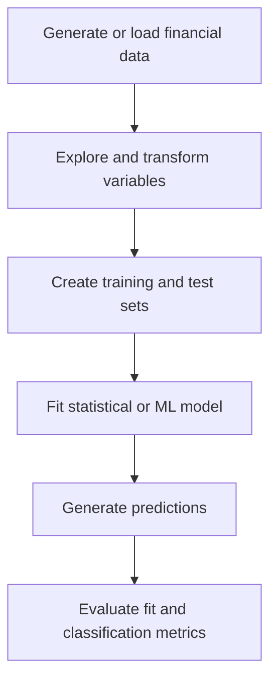

# Machine Learning in Finance

A collection of quantitative-finance notebooks exploring the mathematical and machine-learning foundations used in financial modeling. The repository progresses from high-dimensional distance calculations and regression to censored-data modeling and bank-failure prediction.

## Portfolio Overview

| Topic | Objective | Main methods |
| --- | --- | --- |
| Euclidean distance | Study distance behavior as dimensionality increases | Vectorization, inner products, simulation, descriptive statistics |
| Linear regression | Fit and compare linear models on synthetic financial-style data | NumPy, Scikit-learn, Statsmodels, TensorFlow |
| Tobit regression | Model non-negative and censored dependent variables | Maximum likelihood, TensorFlow, gradient-based optimization |
| Bank-failure prediction | Estimate the probability of FDIC bank failure | Logistic regression, neural networks, ROC-AUC, accuracy, KS statistic |

## Projects

### 1. Euclidean Distance in High Dimensions

[`Euclidian_Distance/`](Euclidian_Distance/)

This notebook investigates how distances between randomly generated points change as the number of dimensions increases.

Key tasks:

- Generate pairs of uniformly distributed random vectors
- Calculate Euclidean distance with loops
- Reimplement the calculation using vectorized operations
- Compare computational performance
- Analyze the expectation and variance of distance
- Visualize the distribution across increasing dimensions

This exercise introduces vectorization and the behavior commonly associated with the curse of dimensionality.

### 2. Linear Regression

[`Euclidian_Distance and linear regression/`](Euclidian_Distance%20and%20linear%20regression/)

The regression notebooks generate synthetic linear and nonlinear data and compare several model implementations.

Key tasks:

- Generate noisy linear and nonlinear datasets
- Estimate coefficients with NumPy
- Train linear-regression models with Scikit-learn
- Analyze models with Statsmodels
- Implement regression with TensorFlow
- Compare model fit using the coefficient of determination, $R^2$

### 3. Tobit Regression

[`Tobit regression/`](Tobit%20regression/)

Tobit regression is designed for dependent variables that are censored or constrained, such as non-negative financial quantities.

The notebooks model:

$$
y(\mathbf{X}) = \max\left(0, w_0 + \sum_{i=1}^{N} w_iX_i + \sigma\varepsilon\right),
\qquad \varepsilon \sim \mathcal{N}(0,1)
$$

Key tasks:

- Generate censored synthetic data with known parameters
- Implement the negative log-likelihood loss
- Estimate regression coefficients and noise volatility
- Train the model with TensorFlow
- Compare linear regression and neural networks on nonlinear data

### 4. Bank-Failure Prediction

[`Bank failure/`](Bank%20failure/)

The bank-failure notebooks build classification models using bank financial indicators and macroeconomic variables.

Bank-level predictors include:

- Total assets
- Net income relative to assets
- Equity relative to assets
- Nonperforming loans
- Real-estate-owned assets
- Loan-loss allowances
- Core and brokered deposits
- Liquidity measures
- Net interest margin
- Asset growth

Macroeconomic predictors include term spreads, stock-market growth, real GDP growth, unemployment changes, Treasury yields, and corporate-credit spreads.

The models are evaluated using:

- Receiver operating characteristic curves
- Area under the ROC curve
- Classification accuracy
- Kolmogorov–Smirnov statistic
- Visual comparison of failed and nonfailed banks

## Analytical Workflow



## Technologies

- **Language:** Python
- **Environment:** Jupyter Notebook
- **Data analysis:** NumPy, Pandas
- **Statistics:** Statsmodels, SciPy
- **Machine learning:** Scikit-learn, TensorFlow
- **Visualization:** Matplotlib
- **Evaluation:** ROC curves, AUC, accuracy, KS statistic, $R^2$

## Project Structure

```text
Machine-Learning-in-Finance/
├── Euclidian_Distance/
│   └── High-dimensional distance simulation
│
├── Euclidian_Distance and linear regression/
│   └── Distance analysis and regression implementations
│
├── Linear regression and robit regression/
│   └── Linear and Tobit regression notebooks
│
├── Tobit regression/
│   └── Censored regression and bank-failure analysis
│
├── Bank failure/
│   └── FDIC bank-failure classification and ROC visualization
│
└── README.md
```

> The folder names `Euclidian_Distance` and `Linear regression and robit regression` are preserved because they match the repository. The standard spellings are **Euclidean** and **Tobit**.

## Getting Started

### 1. Clone the repository

```bash
git clone https://github.com/AI-YAZMIN-VILLEGAS/Machine-Learning-in-Finance.git
cd Machine-Learning-in-Finance
```

### 2. Create a virtual environment

```bash
python -m venv .venv
source .venv/bin/activate
```

On Windows:

```powershell
.venv\Scripts\activate
```

### 3. Install the principal libraries

```bash
pip install jupyter numpy pandas scipy matplotlib scikit-learn statsmodels tensorflow
```

### 4. Launch Jupyter Notebook

```bash
jupyter notebook
```

Open the selected project folder and run its notebook cells in order.

## Data and Compatibility Notes

- The Euclidean-distance, linear-regression, and Tobit exercises generate synthetic data within the notebooks.
- The bank-failure notebooks reference HDF5 datasets from a `readonly` course directory that is not included in this repository. Those files must be supplied separately before the bank models can be retrained.
- Several notebooks were developed with Scikit-learn 0.18 and TensorFlow 1.x APIs. A compatible legacy environment or code migration to current TensorFlow/Keras APIs may be required.
- Some folders contain multiple notebook versions representing original and revised exercises.

## Skills Demonstrated

- Implementing mathematical operations efficiently with NumPy
- Simulating and analyzing high-dimensional data
- Building regression models across multiple Python libraries
- Formulating a custom likelihood function for censored data
- Training TensorFlow models
- Preparing bank-level and macroeconomic predictors
- Comparing statistical and neural-network approaches
- Evaluating binary classifiers with finance-relevant metrics
- Visualizing model behavior and predictive performance
- Interpreting quantitative models in a financial context

## About This Repository

This repository contains educational notebooks and completed assignments developed while studying machine learning in finance. Course instructions, grading utilities, datasets, and starter materials remain attributed to their respective authors and to the original *Machine Learning and Reinforcement Learning in Finance* learning materials.

## Author

**Yazmin Villegas**<br>
Data Analyst | Data Scientist<br>
[GitHub](https://github.com/AI-YAZMIN-VILLEGAS)
